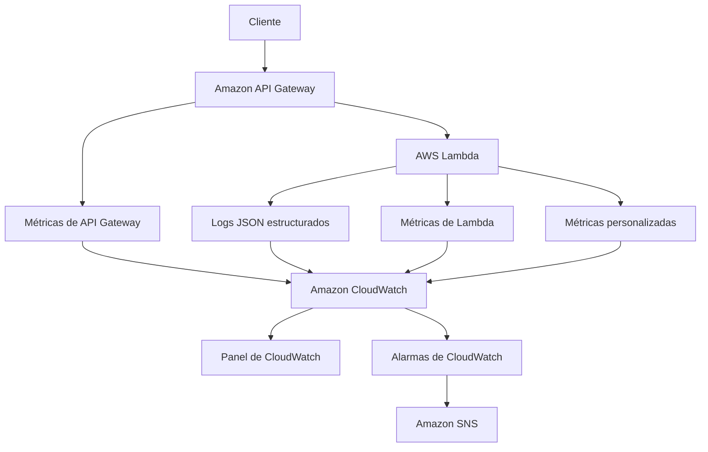

# AWS CDK Observable Serverless API

### API Gateway → Lambda → CloudWatch → SNS

🌐 Idioma: [English](README.md) | **Español**

Este repositorio demuestra cómo agregar observabilidad práctica a una API
serverless pequeña en AWS usando logs, métricas, paneles, alarmas,
notificaciones y runbooks.

**La API es intencionalmente simple. La observabilidad es el tema
central del proyecto.**

Tres rutas (`/health`, `/hello`, `/work`), una función Lambda, sin base
de datos, sin cola, sin sistema de autenticación. Todo lo demás en este
repositorio -- registro estructurado, métricas personalizadas de
CloudWatch, un panel curado, cuatro alarmas conectadas a SNS y runbooks
operativos -- existe para enseñar cómo *operar* de verdad una API como
esta una vez desplegada, no solo cómo levantarla.

---

## Tabla de contenidos

- [El problema que resuelve](#el-problema-que-resuelve)
- [Arquitectura](#arquitectura)
- [Recursos creados](#recursos-creados)
- [Ciclo de vida de la solicitud](#ciclo-de-vida-de-la-solicitud)
- [Registro estructurado en JSON](#registro-estructurado-en-json)
- [Correlación de solicitudes](#correlación-de-solicitudes)
- [Métricas](#métricas)
- [Cómo funcionan las alarmas de CloudWatch](#cómo-funcionan-las-alarmas-de-cloudwatch)
- [Las cuatro alarmas de este proyecto](#las-cuatro-alarmas-de-este-proyecto)
- [Panel de CloudWatch](#panel-de-cloudwatch)
- [Notificaciones de alarmas por SNS](#notificaciones-de-alarmas-por-sns)
- [Señales doradas](#señales-doradas)
- [Métricas vs. logs vs. trazas](#métricas-vs-logs-vs-trazas)
- [Runbooks](#runbooks)
- [Seguridad](#seguridad)
- [Costos](#costos)
- [Despliegue](#despliegue)
- [Recorrido de la demostración](#recorrido-de-la-demostración)
- [Eliminación de recursos](#eliminación-de-recursos)
- [¿Qué cambiaría para producción?](#qué-cambiaría-para-producción)
- [Alternativas arquitectónicas consideradas](#alternativas-arquitectónicas-consideradas)

---

## El problema que resuelve

Desplegar una API es fácil:

```text
Client → API Gateway → Lambda
```

Lo que no es tan obvio es cómo *operarla* una vez que está en producción.
Una API desplegada que nadie puede observar no puede responder preguntas
operativas básicas:

- ¿Está disponible?
- ¿Está fallando?
- ¿Se está volviendo más lenta?
- ¿Cuánto tráfico está recibiendo?
- ¿Los fallos son aislados o generalizados?
- ¿Qué solicitud específica causó un error determinado?
- ¿Qué debería revisar primero un operador cuando algo se ve mal?

Este proyecto construye conceptualmente la misma API sencilla dos veces:
una vez "recién desplegada":

```text
Client → API Gateway → Lambda
```

y otra vez "realmente operable":

```text
Client
   ↓
API Gateway
   ↓
Lambda
   ↓
Logs + Métricas
   ↓
CloudWatch
   ↓
Panel + Alarmas
   ↓
SNS / Operador
```

El código de la aplicación apenas cambia entre ambos escenarios. Casi
todo lo que hay en este repositorio corresponde a la segunda mitad.

## Arquitectura



Consulta [`docs/es/architecture.md`](docs/es/architecture.md) para un
análisis más detallado, que incluye un diagrama de secuencia de una
solicitud individual y el razonamiento detrás de decisiones de diseño
específicas (REST API vs. HTTP API, EMF vs. `PutMetricData`, umbrales de
las alarmas).

## Recursos creados

| Recurso | Propósito |
| --- | --- |
| API Gateway REST API (1 stage: `prod`) | Punto de entrada público para `GET /health`, `/hello`, `/work` |
| Grupo de logs de acceso de API Gateway | Grupo de logs explícito y con retención limitada para los logs de acceso de la API |
| Función Lambda | Ejecuta las tres rutas de la demostración; Node.js 22.x, ARM64, 128MB, timeout de 10s |
| Grupo de logs de Lambda | Grupo de logs explícito y con retención limitada para los logs estructurados de la función |
| Panel de CloudWatch | `<stack-name>-observability` -- filas de métricas de API, Lambda y aplicación |
| Alarma de CloudWatch: errores de Lambda | `<stack-name>-lambda-errors` |
| Alarma de CloudWatch: duración de Lambda | `<stack-name>-lambda-duration` |
| Alarma de CloudWatch: 5xx de la API | `<stack-name>-api-5xx` |
| Alarma de CloudWatch: latencia de la API | `<stack-name>-api-latency` |
| Topic de SNS | `<stack-name>-alarms` -- las cuatro alarmas notifican a este topic |

No se crea base de datos, cola, bus de eventos ni servicio de
autenticación. Las métricas personalizadas usan Embedded Metric Format
(derivado de logs), por lo que no se otorga ni se necesita el permiso
IAM `cloudwatch:PutMetricData` -- consulta
[`docs/es/architecture.md`](docs/es/architecture.md).

## Ciclo de vida de la solicitud

1. El cliente llama a API Gateway.
2. API Gateway invoca a Lambda mediante una integración proxy.
3. Lambda captura el contexto de la solicitud (ID de solicitud, ruta,
   método).
4. Lambda emite logs JSON estructurados.
5. Lambda emite métricas personalizadas de la aplicación (EMF).
6. AWS publica automáticamente las métricas de Lambda.
7. AWS publica automáticamente las métricas de API Gateway.
8. CloudWatch almacena y agrega todo lo anterior.
9. El panel visualiza el estado operativo actual bajo demanda.
10. Las alarmas evalúan los umbrales de las métricas de forma
    independiente, según su propio período.
11. Un cambio de estado de una alarma publica una notificación a SNS.

**El panel no dispara las alarmas.** Las alarmas evalúan las métricas
según su propio cronograma, sin importar si alguien tiene el panel
abierto o no.

## Rutas de la API

| Ruta | Comportamiento |
| --- | --- |
| `GET /health` | Devuelve `{"status": "ok"}` |
| `GET /hello` | Devuelve `{"message": "Hello from the observable serverless API."}` |
| `GET /work` | Simula trabajo; admite `?delayMs=<n>` y `?fail=true` (ver más abajo) |

### Latencia controlada: `/work?delayMs=`

`GET /work?delayMs=2000` hace que el handler ejecute un `await` sobre un
retraso acotado antes de responder, para que puedas generar solicitudes
lentas a demanda. El valor se **limita del lado del servidor a un
máximo de 5000ms**, sin importar lo que se solicite, para que una
demostración no pueda mantener accidentalmente abierta una invocación de
Lambda facturable de forma indefinida. Tanto el retraso solicitado como
el aplicado quedan registrados en los logs.

### Fallo controlado: `/work?fail=true`

`GET /work?fail=true` hace que el handler registre una entrada `ERROR`
estructurada y luego **lance una excepción**. Esto es intencional: una
excepción no controlada en una integración proxy de Lambda produce dos
señales significativas de forma independiente -- un punto de datos de
`Errors` en Lambda, *y* una respuesta `502` de API Gateway (contabilizada
en `5XXError`). Un solo fallo simulado, ambas señales que produciría una
interrupción real.

**Este mecanismo existe únicamente para demostración y pruebas.** Una API
de producción nunca debería exponer una forma de que quien llama fuerce
errores o retrasos del lado del servidor.

## Registro estructurado en JSON

Cada línea de log que escribe la Lambda es un único objeto JSON, no una
cadena de texto arbitraria:

```json
{
  "level": "INFO",
  "message": "Request completed",
  "timestamp": "2026-08-17T12:00:00.000Z",
  "requestId": "abc-123",
  "route": "/work",
  "method": "GET",
  "statusCode": 200,
  "durationMs": 245,
  "coldStart": false,
  "functionName": "ObservableServerlessApiStack-api"
}
```

Compáralo con:

```text
Request worked!
```

La versión en JSON es consultable por máquina: puedes filtrar por
`level = "ERROR"`, agregar `durationMs`, o extraer cada línea de un
`requestId` específico con CloudWatch Logs Insights. La versión en texto
plano solo se puede leer, nunca consultar.

**Niveles:** `INFO` (finalización normal), `WARN` (recuperable/inesperado
pero manejado, p. ej. un `delayMs` fuera de rango), `ERROR` (una solicitud
falló). Nada más elaborado que eso -- este proyecto deliberadamente no
construye un framework de niveles de logging.

El helper de logging en sí tiene alrededor de 20 líneas
(`src/shared/logger.ts`) -- `JSON.stringify` y `console.log`. No se usa
ninguna librería de logging, a propósito: el objetivo es mostrar qué
*es* el registro estructurado, no envolver una dependencia.

### Qué no se registra

Registro estructurado no significa "registrar todo." Este proyecto nunca
registra headers de autorización, credenciales, headers completos de la
solicitud, ni payloads sin procesar proporcionados por el usuario.
Consulta [`docs/es/security.md`](docs/es/security.md) para la política
completa.

## Correlación de solicitudes

Cada línea de log incluye `requestId`, tomado del ID de solicitud de API
Gateway (recurriendo al propio ID de solicitud de la invocación de
Lambda si no está disponible). Una entrada de log es mucho más fácil de
investigar cuando todos los mensajes asociados con una misma solicitud
comparten un identificador -- ver la consulta de `requestId` en Logs
Insights más abajo.

Este proyecto **no** implementa trazabilidad distribuida (distributed
tracing). Con una única función Lambda y sin llamadas a sistemas
posteriores, todavía no hay una ruta de solicitud que trazar. Consulta
[AWS X-Ray](#aws-x-ray) más abajo para cuándo vale la pena agregarla.

## Métricas

Hay tres categorías de métricas en juego, mantenidas deliberadamente
separadas:

### Métricas administradas por AWS (Lambda)

Se publican automáticamente, sin necesidad de código:

| Métrica | Significado |
| --- | --- |
| `Invocations` | Cuántas veces se ejecutó la función |
| `Errors` | Cuántas invocaciones fallaron |
| `Duration` | Cuánto duraron las invocaciones |
| `Throttles` | Cuántas invocaciones fueron limitadas (throttled) |
| `ConcurrentExecutions` | Cuántas invocaciones se ejecutaron al mismo tiempo |

### Métricas administradas por AWS (API Gateway, REST API)

También automáticas:

| Métrica | Significado |
| --- | --- |
| `Count` | Número de solicitudes a la API |
| `Latency` | Tiempo total de ida y vuelta medido por API Gateway |
| `IntegrationLatency` | Tiempo específico esperando la integración con Lambda |
| `4XXError` | Respuestas de error del lado del cliente |
| `5XXError` | Respuestas de error del lado del servidor |

Este proyecto usa una **REST API** (`apigateway.RestApi`), no una HTTP
API -- estos son los nombres de métricas y la dimensión (`ApiName`)
correspondientes a REST API. Si adaptas este proyecto para usar una HTTP
API, las métricas y dimensiones disponibles son diferentes; consulta
[`docs/es/architecture.md`](docs/es/architecture.md).

### Métricas personalizadas de la aplicación

Publicadas por el handler de Lambda mediante Embedded Metric Format
(EMF) -- `src/shared/metrics.ts`:

| Métrica | Unidad | Significado |
| --- | --- | --- |
| `SuccessfulRequests` | Count | Una por cada solicitud manejada con éxito, por ruta |
| `FailedRequests` | Count | Una por cada solicitud fallida, por ruta |
| `WorkDuration` | Milliseconds | Tiempo pasado dentro del handler de `/work` |

**Namespace:** `ObservableServerlessApi`
**Dimensiones:** `Environment` (p. ej. `dev`), `Operation` (`health`,
`hello`, o `work`)

#### Por qué Embedded Metric Format y no `PutMetricData`

Una entrada de log en EMF es una línea de log JSON estructurada normal,
con un bloque `_aws` adicional que le indica a CloudWatch qué campos
extraer como puntos de datos de métricas:

```json
{
  "_aws": {
    "Timestamp": 1734000000000,
    "CloudWatchMetrics": [
      {
        "Namespace": "ObservableServerlessApi",
        "Dimensions": [["Environment", "Operation"]],
        "Metrics": [{ "Name": "SuccessfulRequests", "Unit": "Count" }]
      }
    ]
  },
  "Environment": "dev",
  "Operation": "hello",
  "SuccessfulRequests": 1
}
```

CloudWatch Logs extrae el punto de datos de la métrica de forma
asíncrona a partir de este evento de log. Se eligió este enfoque en lugar
de llamar directamente a `PutMetricData` porque:

- **No se requiere ningún permiso IAM adicional.** La función Lambda ya
  tiene permiso para escribir en su propio grupo de logs de CloudWatch
  Logs (mediante la política administrada `AWSLambdaBasicExecutionRole`
  que CDK adjunta por defecto). Un enfoque con `PutMetricData` necesitaría
  una declaración adicional de `cloudwatch:PutMetricData` en el rol de
  ejecución.
- **Una escritura, dos propósitos.** La misma línea JSON es a la vez un
  evento de log consultable (vía Logs Insights) y un punto de datos de
  métrica. Esa combinación es útil de mostrar en un proyecto educativo
  sobre cómo se relacionan los logs y las métricas.
- **Sin llamada de red adicional.** `PutMetricData` es una llamada
  síncrona a la API desde dentro del handler; EMF solo requiere escribir
  a stdout, que Lambda ya redirige a CloudWatch Logs.

La contrapartida: las métricas de EMF se extraen de forma asíncrona
mediante el pipeline de CloudWatch Logs, así que puede haber un pequeño
retraso adicional (típicamente bastante menos de un minuto) entre el
momento en que se escribe la línea de log y el momento en que aparece el
punto de datos de la métrica, comparado con una llamada directa a
`PutMetricData`.

#### Por qué las dimensiones se mantienen de baja cardinalidad

Las dimensiones de las métricas personalizadas aquí se limitan a
`Environment` y `Operation` -- ambas acotadas a un conjunto pequeño y
fijo de valores. **Nunca** uses `requestId`, `userId`, `email`,
`orderId`, ni ningún otro campo con un número prácticamente ilimitado de
valores posibles como dimensión de una métrica. CloudWatch factura y
almacena las métricas por cada combinación única de nombre de métrica +
valores de dimensión (una *serie temporal de métrica*); una dimensión de
alta cardinalidad convierte cada solicitud individual en su propia serie
temporal facturable, permanente y mayormente inútil. Consulta
[`docs/es/cost-considerations.md`](docs/es/cost-considerations.md).

### Datos de diagnóstico derivados de los logs

Más allá de las métricas, los logs estructurados en sí mismos son
directamente consultables mediante CloudWatch Logs Insights -- ver las
[consultas más abajo](#consultas-de-logs-insights). Las métricas te
dicen *que* algo cambió; los logs te dicen *qué pasó* dentro de una
solicitud específica.

## Cómo funcionan las alarmas de CloudWatch

```text
Métrica
   ↓
Período
   ↓
Estadística
   ↓
Umbral
   ↓
Períodos de evaluación
   ↓
Estado de la alarma
```

Una alarma de CloudWatch observa una métrica, agrega sus puntos de datos
en ventanas de tiempo fijas (**períodos**) usando una **estadística**
elegida (p. ej. `Average`, `Sum`), y compara el valor de cada período
contra un **umbral**. Si suficientes períodos consecutivos (**períodos de
evaluación**, contados mediante **puntos de datos para alarmar**,
*datapoints to alarm*) superan el umbral, la alarma pasa de `OK` a
`ALARM`. Si faltan datos en un período, el **comportamiento ante datos
faltantes** de la alarma decide qué ocurre (este proyecto usa
`notBreaching` en todas partes: un minuto sin actividad no es evidencia
de un problema).

Estados de la alarma:

- **`OK`** -- la métrica está dentro del umbral configurado.
- **`ALARM`** -- la métrica superó el umbral durante la ventana de
  evaluación configurada.
- **`INSUFFICIENT_DATA`** -- todavía no han llegado suficientes datos
  para evaluar (poco frecuente aquí, ya que los datos faltantes se
  tratan como `notBreaching` en lugar de dejarse como insuficientes).

## Las cuatro alarmas de este proyecto

Cada alarma a continuación usa un **período de 1 minuto**, **1 período de
evaluación**, **1 punto de datos para alarmar**, y **`notBreaching`**
para datos faltantes. Esto es intencionalmente sensible y rápido de
demostrar -- apropiado para un laboratorio, no para producción. Consulta
[¿Qué cambiaría para producción?](#qué-cambiaría-para-producción).

| Alarma | Métrica | Estadística | Umbral | Comparación |
| --- | --- | --- | --- | --- |
| `<stack-name>-lambda-errors` | `AWS/Lambda Errors` | Sum | `1` | `>=` |
| `<stack-name>-lambda-duration` | `AWS/Lambda Duration` | Average | `1500 ms` | `>` |
| `<stack-name>-api-5xx` | `AWS/ApiGateway 5XXError` | Sum | `1` | `>=` |
| `<stack-name>-api-latency` | `AWS/ApiGateway Latency` | Average | `1500 ms` | `>` |

Las cuatro alarmas notifican al topic de SNS tanto en transiciones a
**`ALARM`** como a **`OK`**, para que puedas observar un ciclo completo
de incidente y recuperación durante una demostración.

Las alarmas de errores de Lambda y de 5xx de la API se disparan con un
**único** error -- apropiado para una demostración de bajo tráfico, no
una señal de que todo sistema en producción deba alarmar ante un solo
fallo. Los umbrales de producción deberían reflejar el tráfico normal,
un error budget real, la criticidad del negocio y las tasas de fallos
transitorios esperadas.

Las alarmas de duración y latencia usan `Average` con un umbral de
1500ms, elegido porque las respuestas normales de `/health`/`/hello` se
completan muy por debajo de los 100ms, y `/work?delayMs=` puede superar
1500ms trivialmente a demanda. Un sistema en producción típicamente
prefiere p90/p95/p99 en lugar de `Average`, ya que los promedios pueden
ocultar la latencia de cola (tail latency).

## Panel de CloudWatch

Nombre del panel: **`<stack-name>-observability`**

Tres filas, más una franja de estado de alarmas:

### Salud de la API

| Widget | Pregunta operativa |
| --- | --- |
| API Requests | ¿Cuánto tráfico está llegando? |
| API Latency | ¿Los clientes están esperando más de lo debido? |
| API 4XX / 5XX Errors | ¿Están fallando las solicitudes del lado del cliente o del servidor? |

### Salud de Lambda

| Widget | Pregunta operativa |
| --- | --- |
| Lambda Invocations | ¿Cuánta carga está soportando la función? |
| Lambda Errors | ¿Está fallando la ejecución de la aplicación? |
| Lambda Duration (+ Throttles) | ¿Se está ralentizando o limitando (throttling) el procesamiento del backend? |

### Métricas de la aplicación

| Widget | Pregunta operativa |
| --- | --- |
| Successful Requests | ¿Qué considera la propia aplicación un éxito, por ruta? |
| Failed Requests | ¿Qué considera la propia aplicación un fallo, por ruta? |
| Application Work Duration | ¿Cuánto está tardando realmente la ruta simulada `/work`? |

### Estado de las alarmas

Un único widget de estado que lista las cuatro alarmas y su estado
actual, para una revisión rápida sin salir del panel. Haz clic para ir a
la consola de Alarms para ver historial y detalles.

El panel intencionalmente **no** tiene un widget por cada métrica
disponible -- es un conjunto curado que responde preguntas operativas
concretas, no un catálogo exhaustivo de métricas. Consulta
[`docs/es/architecture.md`](docs/es/architecture.md) para conocer el
razonamiento del diseño.

## Notificaciones de alarmas por SNS

```text
Alarma de CloudWatch
       ↓
    Topic de SNS
       ↓
   (opcional) Suscripción por email
```

Un único topic de SNS (`<stack-name>-alarms`) recibe notificaciones de
las cuatro alarmas. No hay ninguna dirección de correo codificada de
forma fija (hardcoded) en ningún lugar de este repositorio. Para
suscribir una dirección de correo, despliega con un valor de contexto
opcional de CDK:

```bash
npx cdk deploy -c alarmEmail=you@example.com
```

Sin `-c alarmEmail=...`, el stack igual crea el topic (su ARN es una
salida del stack) sin suscriptores -- puedes suscribirte manualmente más
tarde desde la consola de SNS o la CLI.

**Las suscripciones por email de SNS requieren confirmación.** Después de
suscribirte, revisa la bandeja de entrada de destino en busca de un
correo de confirmación de AWS y haz clic en el enlace -- no se entregan
notificaciones a una dirección sin confirmar, y la suscripción **no**
entra en vigor de inmediato.

## Señales doradas

Un mapeo simplificado para serverless de las clásicas "cuatro señales
doradas" (Golden Signals):

```text
Latencia    → API Gateway Latency / Lambda Duration
Tráfico     → API Gateway Count / Lambda Invocations
Errores     → API Gateway 5XX / Lambda Errors / FailedRequests personalizada
Saturación  → Lambda Throttles / ConcurrentExecutions
```

Esta es una interpretación simplificada para serverless, no un framework
SRE completo -- aquí no hay planificación de capacidad, ni colas, ni
infraestructura compartida que saturar en el sentido tradicional. Aun
así, es una lente útil para leer el panel: cada fila se corresponde
aproximadamente con una o más de estas cuatro preguntas.

## Métricas vs. logs vs. trazas

| Señal | Mejor para |
| --- | --- |
| Métricas | Tendencias, salud, umbrales |
| Logs | Evidencia detallada de ejecución |
| Trazas | Ruta de la solicitud de extremo a extremo |
| Alarmas | Atención automatizada |
| Paneles | Panorama operativo para humanos |

Y, de forma más precisa:

- Las **métricas** responden: *¿qué está pasando a lo largo del tiempo?*
- Las **alarmas** responden: *¿cuándo debería alguien prestar atención?*
- Los **paneles** responden: *¿cuál es el panorama operativo actual?*
- Los **logs** responden: *¿qué pasó dentro de una solicitud o ejecución
  específica?*
- Los **runbooks** responden: *¿qué debería hacer un operador cuando una
  señal indica un problema?*

Este proyecto se enfoca en **métricas + logs + alarmas + paneles +
runbooks**. La trazabilidad (AWS X-Ray / OpenTelemetry) queda como una
evolución para producción -- ver más abajo.

### Consultas de Logs Insights

Estas consultas coinciden con la estructura de log JSON mostrada más
arriba.

**Errores, más recientes primero:**

```
fields @timestamp, requestId, message, route, statusCode
| filter level = "ERROR"
| sort @timestamp desc
| limit 50
```

**Solicitudes lentas:**

```
fields @timestamp, requestId, route, durationMs
| filter durationMs > 1000
| sort durationMs desc
| limit 50
```

**Cada línea de log de una solicitud:**

```
fields @timestamp, level, message, requestId, route, durationMs
| filter requestId = "REQUEST_ID_HERE"
| sort @timestamp asc
```

Más ejemplos y consultas específicas de solución de problemas están en
[`docs/es/troubleshooting.md`](docs/es/troubleshooting.md).

## Runbooks

- [`docs/es/runbooks/high-error-rate.md`](docs/es/runbooks/high-error-rate.md)
- [`docs/es/runbooks/high-latency.md`](docs/es/runbooks/high-latency.md)

**Una alarma le dice a un operador que algo puede estar mal. Un runbook
le dice al operador qué hacer a continuación.** Código más alarmas sin
un procedimiento de respuesta documentado es una historia de
observabilidad incompleta -- una alarma sin un lugar hacia dónde apuntar
es solo ruido.

## Seguridad

Consulta [`docs/es/security.md`](docs/es/security.md) para el desglose
completo. En resumen: IAM de Lambda con mínimo privilegio (solo
escritura en CloudWatch Logs, sin necesitar permiso de
`PutMetricData`), acceso a la API únicamente por TLS, sin secretos ni
payloads completos de las solicitudes en los logs, y una separación
explícita entre lo implementado en esta muestra y lo recomendado para
producción (autenticación, WAF, políticas IAM de logs más acotadas,
cifrado con una clave administrada por el cliente, redacción de logs).

## Costos

Consulta [`docs/es/cost-considerations.md`](docs/es/cost-considerations.md)
para el desglose completo. En resumen: las solicitudes a API Gateway, la
invocación/duración de Lambda, la ingesta y el almacenamiento de
CloudWatch Logs, el almacenamiento de métricas personalizadas, un panel
y cuatro alarmas son los factores de costo aquí. **La observabilidad
tiene un costo, y más telemetría no es automáticamente mejor
telemetría** -- el conjunto pequeño y acotado de logs/métricas/alarmas/
paneles de este proyecto es una decisión de diseño deliberada, no un
descuido.

## Despliegue

```bash
npm install
npm run build
npm test
npx cdk synth
npx cdk diff
npx cdk deploy
```

Para además crear una suscripción por email en el topic de alarmas:

```bash
npx cdk deploy -c alarmEmail=you@example.com
```

Recuerda: SNS enviará por correo un enlace de confirmación a esa
dirección, y no se entregará ninguna notificación de alarma hasta que se
haga clic en él.

Después de desplegar, anota las salidas (outputs) del stack: `ApiUrl`,
`DashboardName`, `DashboardUrl`, `AlarmTopicArn`, y `LambdaLogGroupName`.

## Recorrido de la demostración

### Paso 1 — Desplegar

```bash
npx cdk deploy
```

Toma el valor de salida `ApiUrl`, por ejemplo:

```bash
export API_URL="https://abc123xyz.execute-api.us-east-1.amazonaws.com/prod"
```

### Paso 2 — Enviar tráfico saludable

```bash
curl "$API_URL/health"
curl "$API_URL/hello"
```

Espera respuestas `200` rápidas y cuerpos JSON como `{"status":"ok"}`.

### Paso 3 — Generar una solicitud lenta

```bash
curl "$API_URL/work?delayMs=2000"
```

Observa cómo suben **API Latency** y **Lambda Duration** en el panel
para el punto de datos de ese minuto.

### Paso 4 — Generar un error

```bash
curl "$API_URL/work?fail=true"
```

Debido al carácter `&` al combinar parámetros de consulta, entrecomilla
la URL completa:

```bash
curl "$API_URL/work?delayMs=1000&fail=true"
```

Espera un `502` HTTP de API Gateway. Observa **Lambda Errors** y
**API 4XX / 5XX Errors** en el panel.

### Paso 5 — Abrir el panel de CloudWatch

Usa la salida del stack `DashboardUrl`, o navega a CloudWatch →
Dashboards → `<stack-name>-observability` en la región correcta.
Observa el conteo de solicitudes, la latencia, la duración de Lambda,
los errores, y las métricas personalizadas
`SuccessfulRequests`/`FailedRequests`/`WorkDuration`.

### Paso 6 — Consultar los logs

Abre el grupo de logs de la Lambda (salida `LambdaLogGroupName`) en
CloudWatch Logs Insights y ejecuta:

```
fields @timestamp, requestId, message, route, statusCode
| filter level = "ERROR"
| sort @timestamp desc
| limit 50
```

### Paso 7 — Inspeccionar el estado de las alarmas

Abre CloudWatch → Alarms. Después de enviar suficientes solicitudes
fallidas/lentas, espera que la(s) alarma(s) correspondiente(s) pasen a
`ALARM` en un plazo de aproximadamente uno a algunos minutos -- CloudWatch
agrega en períodos y evalúa las alarmas según su propio cronograma, no
al instante con cada solicitud. Si suscribiste una dirección de correo,
espera una notificación cuando la alarma transicione (y otra cuando se
recupere a `OK`).

### Paso 8 — Seguir el runbook

Con una alarma en estado `ALARM`, sigue el runbook correspondiente:
[`docs/es/runbooks/high-error-rate.md`](docs/es/runbooks/high-error-rate.md)
o
[`docs/es/runbooks/high-latency.md`](docs/es/runbooks/high-latency.md).

## Eliminación de recursos

```bash
npx cdk destroy
```

Esto elimina todos los recursos que creó el stack: la REST API de API
Gateway, la función Lambda, ambos grupos de logs de CloudWatch (los
datos retenidos se eliminan junto con ellos -- se usa
`RemovalPolicy.DESTROY` específicamente para que un entorno de
laboratorio se limpie por completo), el panel, las cuatro alarmas, y el
topic de SNS (incluyendo cualquier suscripción que tenga).

## ¿Qué cambiaría para producción?

**Implementado en esta muestra:**

- Registro estructurado en JSON con correlación de solicitudes
- Métricas personalizadas vía EMF, con dimensiones acotadas
- Cuatro alarmas ajustadas para demostración, conectadas a SNS
- Un panel de CloudWatch curado, de tres filas
- Retención de logs explícita y finita (7 días)
- IAM de Lambda con mínimo privilegio (sin permisos innecesarios)
- Suscripción por email de SNS opcional y sin datos codificados de forma
  fija (hardcoded)
- Runbooks operativos para las dos categorías de alarmas

**Recomendado para producción** (no implementado aquí, para mantener
esta muestra enfocada):

- Autenticación/autorización de la API (IAM, un Lambda authorizer, o
  Cognito)
- Límite de tasa (rate limiting) / usage plans, y AWS WAF para APIs
  públicas
- Alarmas por porcentaje/tasa de error (`errores / solicitudes`) en lugar
  de conteos absolutos, reflejando un error budget real
- Alarmas de latencia p90/p95/p99 en lugar de `Average`
- Alarmas de detección de anomalías para señales sin un umbral estático
  estable
- Alarmas compuestas y deduplicación de alarmas para reducir el ruido
- SLOs/SLIs -- p. ej. *SLI: porcentaje de solicitudes exitosas*, *SLO:
  99.9% de solicitudes exitosas en 30 días* -- con alarmas que reflejen
  el objetivo en lugar de un número arbitrario
- Registro centralizado/entre servicios, si esto crece más allá de una
  sola función
- Trazabilidad distribuida (distributed tracing): [AWS X-Ray](#aws-x-ray)
  u [OpenTelemetry](#opentelemetry) una vez que exista una ruta de
  solicitud real que trazar entre servicios
- Paneles y umbrales específicos por entorno (dev/staging/prod)
- Integración con herramientas de gestión de incidentes (PagerDuty/Slack)
  y políticas de escalamiento
- Retención de logs más larga o guiada por cumplimiento normativo, más
  redacción de logs para futuros campos con PII
- Runbooks de producción que cubran procedimientos de despliegue/rollback
- Canarios sintéticos (synthetic canaries) y monitoreo de la salud de los
  despliegues

## Alternativas arquitectónicas consideradas

### Observabilidad nativa de CloudWatch (elegida)

**Ventajas:** integración nativa con AWS, baja complejidad de
configuración, métricas administradas por AWS disponibles sin código
adicional, soporte de primera clase en CDK, operaciones centralizadas de
AWS (los logs, las métricas, las alarmas y los propios recursos viven en
la misma consola/cuenta).

**Contrapartidas:** la experiencia de consulta/visualización es menos
pulida que la de algunas plataformas de observabilidad dedicadas; la
observabilidad entre sistemas (muchos servicios, múltiples nubes) se
vuelve más compleja; el costo debe gestionarse activamente a medida que
crece el uso (consulta
[`docs/es/cost-considerations.md`](docs/es/cost-considerations.md)).

### AWS X-Ray

Agrega trazabilidad distribuida y análisis de la ruta de la solicitud.
No es necesario para esta muestra intencionalmente pequeña, de una sola
Lambda -- todavía no hay una ruta de solicitud de varios saltos que
trazar. Vale la pena agregarlo una vez que esta API llame a otros
servicios.

### OpenTelemetry

Ofrece instrumentación independiente del proveedor (vendor-neutral),
valiosa para sistemas distribuidos más amplios o entornos multi-nube.
Agrega un SDK/collector y complejidad real que no se justifica para una
primera demostración de observabilidad de una sola función.

### Plataformas de observabilidad de terceros

Opciones como Datadog, New Relic, o el ecosistema de Grafana pueden
ofrecer observabilidad multiplataforma más rica, alertas unificadas
entre múltiples nubes/proveedores, y una experiencia de consulta más
avanzada. También agregan costo y complejidad operativa (agentes, claves
de API, otra relación con un proveedor). CloudWatch no es universalmente
superior -- es la opción por defecto correcta para un proyecto que se
mantiene enteramente dentro de una cuenta de AWS, y el primer paso
natural antes de recurrir a una plataforma dedicada.
