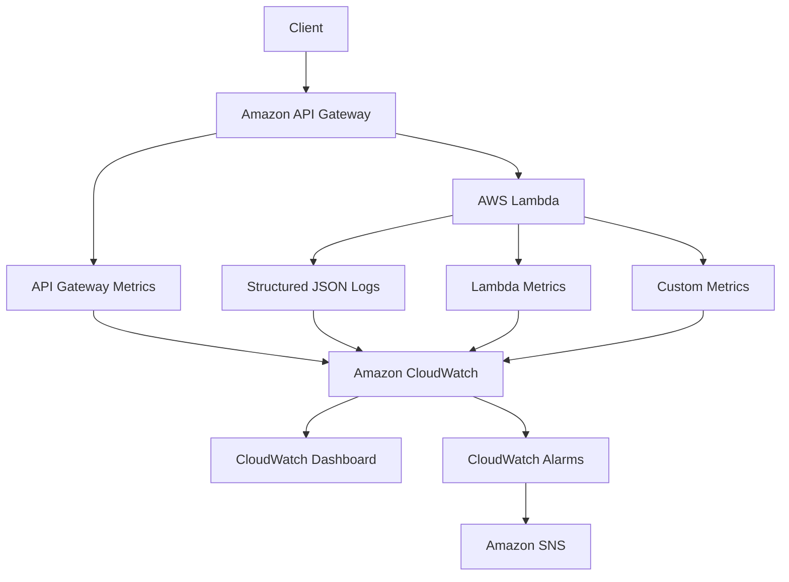

# AWS CDK Observable Serverless API

### API Gateway → Lambda → CloudWatch → SNS

This repository demonstrates how to add practical observability to a
small AWS serverless API using logs, metrics, dashboards, alarms,
notifications, and runbooks.

**The API is intentionally simple. Observability is the subject of the
project.**

Three routes (`/health`, `/hello`, `/work`), one Lambda function, no
database, no queue, no auth system. Everything else in this repository --
structured logging, custom CloudWatch metrics, a curated dashboard, four
alarms wired to SNS, and operational runbooks -- exists to teach how you'd
actually *operate* an API like this once it's deployed, not just stand it
up.

---

## Table of contents

- [The problem this solves](#the-problem-this-solves)
- [Architecture](#architecture)
- [Resources created](#resources-created)
- [Request lifecycle](#request-lifecycle)
- [Structured JSON logging](#structured-json-logging)
- [Request correlation](#request-correlation)
- [Metrics](#metrics)
- [How CloudWatch alarms work](#how-cloudwatch-alarms-work)
- [The four alarms in this project](#the-four-alarms-in-this-project)
- [CloudWatch dashboard](#cloudwatch-dashboard)
- [SNS alarm notifications](#sns-alarm-notifications)
- [Golden signals](#golden-signals)
- [Metrics vs logs vs traces](#metrics-vs-logs-vs-traces)
- [Runbooks](#runbooks)
- [Security](#security)
- [Cost](#cost)
- [Deploying](#deploying)
- [Demo walkthrough](#demo-walkthrough)
- [Destroying](#destroying)
- [What would change for production?](#what-would-change-for-production)
- [Architectural alternatives considered](#architectural-alternatives-considered)

---

## The problem this solves

It's easy to deploy an API:

```text
Client → API Gateway → Lambda
```

It's much less obvious how to *operate* one once it's live. A deployed
API that nobody can observe can't answer basic operational questions:

- Is it available?
- Is it failing?
- Is it getting slower?
- How much traffic is it receiving?
- Are failures isolated or widespread?
- Which specific request caused a given error?
- What should an operator check first when something looks wrong?

This project builds the same simple API twice, conceptually -- once as
"just deployed":

```text
Client → API Gateway → Lambda
```

and once as "actually operable":

```text
Client
   ↓
API Gateway
   ↓
Lambda
   ↓
Logs + Metrics
   ↓
CloudWatch
   ↓
Dashboard + Alarms
   ↓
SNS / Operator
```

The application code barely changes between those two pictures. Almost
everything in this repository is the second half.

## Architecture



See `docs/architecture.md` for a deeper breakdown, including a sequence
diagram of a single request and the reasoning behind specific design
choices (REST API vs HTTP API, EMF vs `PutMetricData`, alarm thresholds).

## Resources created

| Resource | Purpose |
| --- | --- |
| API Gateway REST API (1 stage: `prod`) | Public entry point for `GET /health`, `/hello`, `/work` |
| API Gateway access log group | Explicit, retention-limited log group for API access logs |
| Lambda function | Executes all three routes; Node.js 22.x, ARM64, 128MB, 10s timeout |
| Lambda log group | Explicit, retention-limited log group for the function's structured logs |
| CloudWatch dashboard | `<stack-name>-observability` -- API, Lambda, and application metric rows |
| CloudWatch alarm: Lambda errors | `<stack-name>-lambda-errors` |
| CloudWatch alarm: Lambda duration | `<stack-name>-lambda-duration` |
| CloudWatch alarm: API 5xx | `<stack-name>-api-5xx` |
| CloudWatch alarm: API latency | `<stack-name>-api-latency` |
| SNS topic | `<stack-name>-alarms` -- all four alarms notify this topic |

No database, queue, event bus, or auth service is created. Custom
metrics use Embedded Metric Format (log-derived), so no
`cloudwatch:PutMetricData` IAM permission is granted or needed -- see
`docs/architecture.md`.

## Request lifecycle

1. Client calls API Gateway.
2. API Gateway invokes Lambda via a proxy integration.
3. Lambda captures request context (request ID, route, method).
4. Lambda emits structured JSON logs.
5. Lambda emits custom application metrics (EMF).
6. AWS automatically publishes Lambda metrics.
7. AWS automatically publishes API Gateway metrics.
8. CloudWatch stores and aggregates all of the above.
9. The dashboard visualizes current operational health on demand.
10. Alarms evaluate metric thresholds independently, on their own period.
11. An alarm state change publishes a notification to SNS.

**The dashboard does not trigger the alarms.** Alarms evaluate metrics on
their own schedule regardless of whether anyone has the dashboard open.

## API routes

| Route | Behavior |
| --- | --- |
| `GET /health` | Returns `{"status": "ok"}` |
| `GET /hello` | Returns `{"message": "Hello from the observable serverless API."}` |
| `GET /work` | Simulates work; supports `?delayMs=<n>` and `?fail=true` (see below) |

### Controlled latency: `/work?delayMs=`

`GET /work?delayMs=2000` makes the handler `await` a bounded delay before
responding, so you can generate slow requests on demand. The value is
**clamped server-side to a maximum of 5000ms**, regardless of what's
requested, so a demo can't accidentally hold a billable Lambda invocation
open indefinitely. Both the requested and applied delay are logged.

### Controlled failure: `/work?fail=true`

`GET /work?fail=true` makes the handler log a structured `ERROR` entry
and then **throw**. This is deliberate: an unhandled exception in a
Lambda proxy integration produces two independently meaningful signals --
a Lambda `Errors` metric data point, *and* an API Gateway `502` response
(counted toward `5XXError`). One simulated failure, both signals a real
outage would produce.

**This mechanism exists solely for demonstration and testing.** A
production API should never ship a caller-controlled way to force
server-side errors or delays.

## Structured JSON logging

Every log line the Lambda writes is a single JSON object, not an
arbitrary string:

```json
{
  "level": "INFO",
  "message": "Request completed",
  "timestamp": "2026-08-17T12:00:00.000Z",
  "requestId": "abc-123",
  "route": "/work",
  "method": "GET",
  "statusCode": 200,
  "durationMs": 245,
  "coldStart": false,
  "functionName": "ObservableServerlessApiStack-api"
}
```

Compare that to:

```text
Request worked!
```

The JSON version is machine-queryable: you can filter on `level =
"ERROR"`, aggregate `durationMs`, or pull every line for one
`requestId` with CloudWatch Logs Insights. The string version can only be
read, never queried.

**Levels:** `INFO` (normal completion), `WARN` (recoverable/unexpected but
handled, e.g. an out-of-range `delayMs`), `ERROR` (a request failed).
Nothing more elaborate than that -- this project intentionally does not
build a logging-level framework.

The logging helper itself is about 20 lines
(`src/shared/logger.ts`) -- `JSON.stringify` and `console.log`. No
logging library is used, on purpose: the goal is to show what structured
logging *is*, not to wrap a dependency.

### What is not logged

Structured logging does not mean "log everything." This project never
logs authorization headers, credentials, full request headers, or raw
user-provided payloads. See `docs/security.md` for the full policy.

## Request correlation

Every log line includes `requestId`, taken from the API Gateway request
ID (falling back to the Lambda invocation's own request ID if
unavailable). A useful log entry is much easier to investigate when every
message associated with one request shares an identifier -- see the
`requestId` Logs Insights query below.

This project does **not** implement distributed tracing. With a single
Lambda function and no downstream calls, there's no request path to
trace yet. See [AWS X-Ray](#aws-x-ray) below for when that becomes
worth adding.

## Metrics

Three categories of metrics are in play, deliberately kept distinct:

### AWS-managed metrics (Lambda)

Published automatically, no code required:

| Metric | Meaning |
| --- | --- |
| `Invocations` | How many times the function ran |
| `Errors` | How many invocations failed |
| `Duration` | How long invocations took |
| `Throttles` | How many invocations were throttled |
| `ConcurrentExecutions` | How many invocations ran at once |

### AWS-managed metrics (API Gateway, REST API)

Also automatic:

| Metric | Meaning |
| --- | --- |
| `Count` | Number of API requests |
| `Latency` | Full round-trip time as measured by API Gateway |
| `IntegrationLatency` | Time spent specifically waiting on the Lambda integration |
| `4XXError` | Client-side error responses |
| `5XXError` | Server-side error responses |

This project uses a **REST API** (`apigateway.RestApi`), not an HTTP API
-- these are the REST API metric names and dimension (`ApiName`). If you
adapt this project to an HTTP API, the available metrics and dimensions
differ; see `docs/architecture.md`.

### Custom application metrics

Published by the Lambda handler via Embedded Metric Format (EMF) --
`src/shared/metrics.ts`:

| Metric | Unit | Meaning |
| --- | --- | --- |
| `SuccessfulRequests` | Count | One per successfully handled request, per route |
| `FailedRequests` | Count | One per failed request, per route |
| `WorkDuration` | Milliseconds | Time spent inside the `/work` handler |

**Namespace:** `ObservableServerlessApi`
**Dimensions:** `Environment` (e.g. `dev`), `Operation` (`health`,
`hello`, or `work`)

#### Why Embedded Metric Format, not `PutMetricData`

An EMF log entry is a normal JSON log line with an added `_aws` block
that tells CloudWatch which fields to extract as metric data points:

```json
{
  "_aws": {
    "Timestamp": 1734000000000,
    "CloudWatchMetrics": [
      {
        "Namespace": "ObservableServerlessApi",
        "Dimensions": [["Environment", "Operation"]],
        "Metrics": [{ "Name": "SuccessfulRequests", "Unit": "Count" }]
      }
    ]
  },
  "Environment": "dev",
  "Operation": "hello",
  "SuccessfulRequests": 1
}
```

CloudWatch parses the metric out of the log stream asynchronously. This
was chosen over calling `PutMetricData` directly because it needs **no
additional IAM permission** beyond the Lambda's existing CloudWatch Logs
write access, and because it ties the "log" and "metric" halves of this
project together in one mechanism. See `docs/architecture.md` for the
full tradeoff discussion.

#### Why dimensions stay low-cardinality

Custom metric dimensions here are limited to `Environment` and
`Operation` -- both bounded to a small, fixed set of values. **Never**
use `requestId`, `userId`, `email`, `orderId`, or any other field with
effectively unlimited possible values as a metric dimension. CloudWatch
bills and stores metrics per unique combination of metric name +
dimension values (a *metric time series*); a high-cardinality dimension
turns every single request into its own permanent, mostly-useless
billable time series. See `docs/cost-considerations.md`.

### Log-derived diagnostic data

Beyond metrics, the structured logs themselves are directly queryable via
CloudWatch Logs Insights -- see the [queries below](#logs-insights-queries).
Metrics tell you *that* something changed; logs tell you *what happened*
inside a specific request.

## How CloudWatch alarms work

```text
Metric
   ↓
Period
   ↓
Statistic
   ↓
Threshold
   ↓
Evaluation periods
   ↓
Alarm state
```

A CloudWatch alarm watches one metric, aggregates its data points into
fixed time windows (**periods**) using a chosen **statistic** (e.g.
`Average`, `Sum`), and compares each period's value against a
**threshold**. If enough consecutive periods (**evaluation periods**,
counted via **datapoints to alarm**) breach the threshold, the alarm
transitions from `OK` to `ALARM`. If data is missing for a period, the
alarm's **missing-data behavior** decides what happens (this project uses
`notBreaching` everywhere: a quiet minute is not evidence of a problem).

Alarm states:

- **`OK`** -- the metric is within the configured threshold.
- **`ALARM`** -- the metric has breached the threshold for the configured
  evaluation window.
- **`INSUFFICIENT_DATA`** -- not enough data has arrived yet to evaluate
  (rare here, since missing data is treated as `notBreaching` rather than
  left as insufficient).

## The four alarms in this project

Every alarm below uses a **1-minute period**, **1 evaluation period**,
**1 datapoint to alarm**, and **`notBreaching`** for missing data. This
is intentionally sensitive and fast to demonstrate -- appropriate for a
lab, not for production. See
[What would change for production?](#what-would-change-for-production).

| Alarm | Metric | Statistic | Threshold | Comparison |
| --- | --- | --- | --- | --- |
| `<stack-name>-lambda-errors` | `AWS/Lambda Errors` | Sum | `1` | `>=` |
| `<stack-name>-lambda-duration` | `AWS/Lambda Duration` | Average | `1500 ms` | `>` |
| `<stack-name>-api-5xx` | `AWS/ApiGateway 5XXError` | Sum | `1` | `>=` |
| `<stack-name>-api-latency` | `AWS/ApiGateway Latency` | Average | `1500 ms` | `>` |

All four alarms notify the SNS topic on **both** `ALARM` and `OK`
transitions, so you can observe a full incident-and-recovery cycle during
a demo.

The Lambda error and API 5xx alarms fire on a **single** error --
appropriate for a low-traffic demo, not a signal that every production
system should alarm on one failure. Production thresholds should reflect
normal traffic, an actual error budget, business criticality, and
expected transient failure rates.

The duration and latency alarms use `Average` at a 1500ms threshold,
chosen because normal `/health`/`/hello` responses complete in well under
100ms, and `/work?delayMs=` can trivially exceed 1500ms on demand. A
production system typically prefers p90/p95/p99 over `Average`, since
averages can hide tail latency.

## CloudWatch dashboard

Dashboard name: **`<stack-name>-observability`**

Three rows, plus an alarm status strip:

### API Health

| Widget | Operational question |
| --- | --- |
| API Requests | How much traffic is arriving? |
| API Latency | Are clients waiting longer than they should? |
| API 4XX / 5XX Errors | Are client or server-side requests failing? |

### Lambda Health

| Widget | Operational question |
| --- | --- |
| Lambda Invocations | How much load is the function under? |
| Lambda Errors | Is application execution failing? |
| Lambda Duration (+ Throttles) | Is backend processing slowing down or being throttled? |

### Application Metrics

| Widget | Operational question |
| --- | --- |
| Successful Requests | What does the application itself consider a success, per route? |
| Failed Requests | What does the application itself consider a failure, per route? |
| Application Work Duration | How long is the simulated `/work` route actually taking? |

### Alarm Status

A single status widget listing all four alarms and their current state,
for at-a-glance triage without leaving the dashboard. Click through to
the Alarms console for history and details.

The dashboard intentionally does **not** have one widget per available
metric -- it's a curated set answering specific operational questions,
not an exhaustive metric catalog. See `docs/architecture.md` for the
design rationale.

## SNS alarm notifications

```text
CloudWatch Alarm
       ↓
    SNS Topic
       ↓
   (optional) Email subscription
```

A single SNS topic (`<stack-name>-alarms`) receives notifications from
all four alarms. No email address is hardcoded anywhere in this
repository. To subscribe an email address, deploy with an optional CDK
context value:

```bash
npx cdk deploy -c alarmEmail=you@example.com
```

Without `-c alarmEmail=...`, the stack still creates the topic (its ARN
is a stack output) with no subscribers -- you can subscribe manually
later via the SNS console or CLI.

**SNS email subscriptions require confirmation.** After subscribing,
check the target inbox for a confirmation email from AWS and click the
link -- no notifications are delivered to an unconfirmed address, and
subscribing does **not** take effect immediately.

## Golden signals

A simplified serverless mapping of the classic "four golden signals":

```text
Latency    → API Gateway Latency / Lambda Duration
Traffic    → API Gateway Count / Lambda Invocations
Errors     → API Gateway 5XX / Lambda Errors / custom FailedRequests
Saturation → Lambda Throttles / ConcurrentExecutions
```

This is a simplified serverless interpretation, not a complete SRE
framework -- there's no capacity planning, no queueing, and no shared
infrastructure to saturate in the traditional sense here. It's a useful
lens for reading the dashboard, though: each row roughly maps to one or
more of these four questions.

## Metrics vs logs vs traces

| Signal | Best for |
| --- | --- |
| Metrics | Trends, health, thresholds |
| Logs | Detailed execution evidence |
| Traces | End-to-end request path |
| Alarms | Automated attention |
| Dashboards | Human operational overview |

And, distinctly:

- **Metrics** answer: *what is happening over time?*
- **Alarms** answer: *when should someone pay attention?*
- **Dashboards** answer: *what is the current operational picture?*
- **Logs** answer: *what happened inside a specific request or
  execution?*
- **Runbooks** answer: *what should an operator do when a signal
  indicates a problem?*

This project focuses on **metrics + logs + alarms + dashboards +
runbooks**. Tracing (AWS X-Ray / OpenTelemetry) is left as a production
evolution -- see below.

### Logs Insights queries

These match the JSON log structure shown above.

**Errors, most recent first:**

```
fields @timestamp, requestId, message, route, statusCode
| filter level = "ERROR"
| sort @timestamp desc
| limit 50
```

**Slow requests:**

```
fields @timestamp, requestId, route, durationMs
| filter durationMs > 1000
| sort durationMs desc
| limit 50
```

**Every log line for one request:**

```
fields @timestamp, level, message, requestId, route, durationMs
| filter requestId = "REQUEST_ID_HERE"
| sort @timestamp asc
```

More examples and troubleshooting-specific queries live in
`docs/troubleshooting.md`.

## Runbooks

- [`docs/runbooks/high-error-rate.md`](docs/runbooks/high-error-rate.md)
- [`docs/runbooks/high-latency.md`](docs/runbooks/high-latency.md)

**An alarm tells an operator that something may be wrong. A runbook tells
the operator what to do next.** Code plus alarms without a documented
response procedure is an incomplete observability story -- an alarm with
nowhere to point is just noise.

## Security

See [`docs/security.md`](docs/security.md) for the full breakdown. In
short: least-privilege Lambda IAM (CloudWatch Logs write only, no
`PutMetricData` permission needed), TLS-only API access, no secrets or
full request payloads in logs, and an explicit split between what's
implemented in this sample versus recommended for production
(authentication, WAF, scoped-down log IAM policies, encryption with a
customer-managed key, log redaction).

## Cost

See [`docs/cost-considerations.md`](docs/cost-considerations.md) for the
full breakdown. In short: API Gateway requests, Lambda invocation/duration,
CloudWatch Logs ingestion and storage, custom metric storage, one
dashboard, and four alarms are the cost drivers here. **Observability has
a cost, and more telemetry is not automatically better telemetry** --
this project's small, bounded set of logs/metrics/alarms/dashboards is a
deliberate design choice, not an oversight.

## Deploying

```bash
npm install
npm run build
npm test
npx cdk synth
npx cdk diff
npx cdk deploy
```

To also create an email subscription on the alarm topic:

```bash
npx cdk deploy -c alarmEmail=you@example.com
```

Remember: SNS will email a confirmation link to that address, and no
alarm notifications are delivered until it's clicked.

After deploying, note the stack outputs: `ApiUrl`, `DashboardName`,
`DashboardUrl`, `AlarmTopicArn`, and `LambdaLogGroupName`.

## Demo walkthrough

### Step 1 — Deploy

```bash
npx cdk deploy
```

Grab the `ApiUrl` output, e.g.:

```bash
export API_URL="https://abc123xyz.execute-api.us-east-1.amazonaws.com/prod"
```

### Step 2 — Send healthy traffic

```bash
curl "$API_URL/health"
curl "$API_URL/hello"
```

Expect fast `200` responses and JSON bodies like `{"status":"ok"}`.

### Step 3 — Generate a slow request

```bash
curl "$API_URL/work?delayMs=2000"
```

Watch **API Latency** and **Lambda Duration** on the dashboard rise for
that minute's data point.

### Step 4 — Generate an error

```bash
curl "$API_URL/work?fail=true"
```

Because of the `&` character, when combining query parameters, quote the
whole URL:

```bash
curl "$API_URL/work?delayMs=1000&fail=true"
```

Expect an HTTP `502` from API Gateway. Watch **Lambda Errors** and **API
4XX / 5XX Errors** on the dashboard.

### Step 5 — Open the CloudWatch dashboard

Use the `DashboardUrl` stack output, or navigate to CloudWatch →
Dashboards → `<stack-name>-observability` in the correct region. Observe
request count, latency, Lambda duration, errors, and the custom
`SuccessfulRequests`/`FailedRequests`/`WorkDuration` metrics.

### Step 6 — Query the logs

Open the Lambda's log group (`LambdaLogGroupName` output) in CloudWatch
Logs Insights and run:

```
fields @timestamp, requestId, message, route, statusCode
| filter level = "ERROR"
| sort @timestamp desc
| limit 50
```

### Step 7 — Inspect alarm state

Open CloudWatch → Alarms. After sending enough failing/slow requests,
expect the relevant alarm(s) to move to `ALARM` within roughly one to a
few minutes -- CloudWatch aggregates into periods and evaluates
alarms on its own schedule, not instantly on each request. If you
subscribed an email address, expect a notification once the alarm
transitions (and another once it recovers to `OK`).

### Step 8 — Follow the runbook

With an alarm in `ALARM` state, work through the matching runbook:
[`docs/runbooks/high-error-rate.md`](docs/runbooks/high-error-rate.md) or
[`docs/runbooks/high-latency.md`](docs/runbooks/high-latency.md).

## Destroying

```bash
npx cdk destroy
```

This removes every resource the stack created: the API Gateway REST API,
the Lambda function, both CloudWatch log groups (retained data is deleted
with them -- `RemovalPolicy.DESTROY` is used specifically so a lab
environment cleans up completely), the dashboard, all four alarms, and
the SNS topic (including any subscriptions on it).

## What would change for production?

**Implemented in this sample:**

- Structured JSON logging with request correlation
- Custom metrics via EMF, bounded dimensions
- Four demonstration-tuned alarms wired to SNS
- A curated, three-row CloudWatch dashboard
- Explicit, finite log retention (7 days)
- Least-privilege Lambda IAM (no unnecessary permissions)
- Optional, non-hardcoded SNS email subscription
- Operational runbooks for the two alarm categories

**Recommended for production** (not implemented here, to keep this
sample focused):

- API authentication/authorization (IAM, Lambda authorizer, or Cognito)
- Rate limiting / usage plans, and AWS WAF for public APIs
- Percentage/error-rate alarms (`errors / requests`) instead of absolute
  counts, reflecting an actual error budget
- p90/p95/p99 latency alarms instead of `Average`
- Anomaly detection alarms for signals without a stable static threshold
- Composite alarms and alarm deduplication to reduce noise
- SLOs/SLIs -- e.g. *SLI: percentage of successful requests*, *SLO: 99.9%
  successful requests over 30 days* -- with alarms that reflect the
  objective rather than an arbitrary number
- Centralized/cross-service logging, if this grows beyond one function
- Distributed tracing: [AWS X-Ray](#aws-x-ray) or
  [OpenTelemetry](#opentelemetry) once there's an actual request path to
  trace across services
- Environment-specific dashboards and thresholds (dev/staging/prod)
- Incident tooling integration (PagerDuty/Slack) and escalation policies
- Longer or compliance-driven log retention, plus log redaction for any
  future PII-bearing fields
- Production runbooks covering deployment/rollback procedures
- Synthetic canaries and deployment-health monitoring

## Architectural alternatives considered

### CloudWatch native observability (chosen)

**Advantages:** native AWS integration, low setup complexity, AWS-managed
metrics available with zero extra code, first-class CDK support,
centralized AWS operations (logs, metrics, alarms, and the resources
themselves all live in the same console/account).

**Tradeoffs:** the query/visualization experience is less polished than
some dedicated observability platforms; cross-system observability (many
services, multiple clouds) gets more complex; cost must be actively
managed as usage grows (see `docs/cost-considerations.md`).

### AWS X-Ray

Adds distributed tracing and request-path analysis. Not necessary for
this intentionally small, single-Lambda sample -- there is no multi-hop
request path to trace yet. Worth adding once this API calls other
services.

### OpenTelemetry

Provides vendor-neutral instrumentation, valuable for broader
distributed systems or multi-cloud environments. Adds an SDK/collector
and real complexity that isn't justified for a first, single-function
observability demo.

### Third-party observability platforms

Options like Datadog, New Relic, or the Grafana ecosystem can provide
richer cross-platform observability, unified alerting across multiple
clouds/vendors, and more advanced querying UX. They also add cost and
operational complexity (agents, API keys, another vendor relationship).
CloudWatch is not universally superior -- it's the right default for a
project that stays entirely inside one AWS account, and the natural
first stop before reaching for a dedicated platform.
