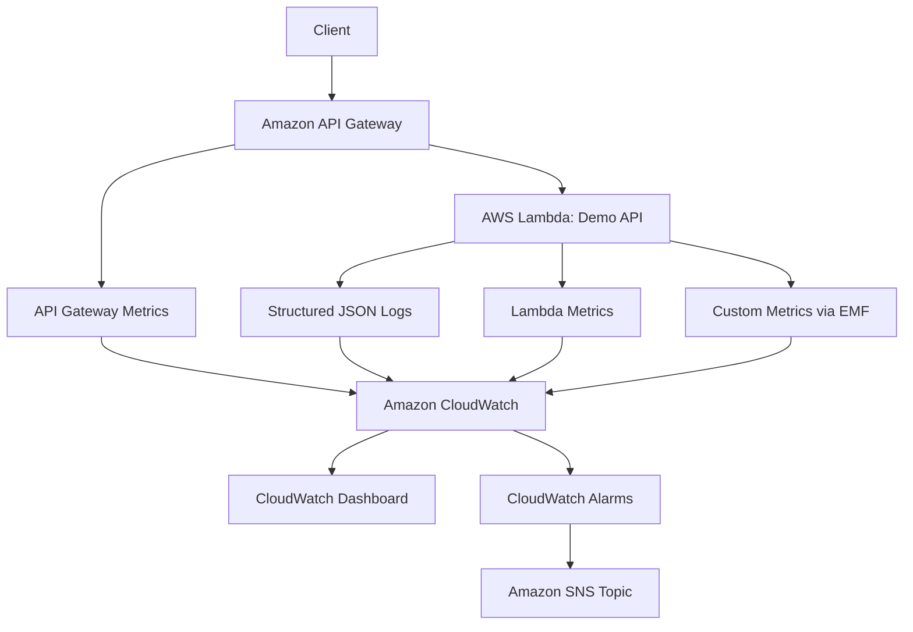
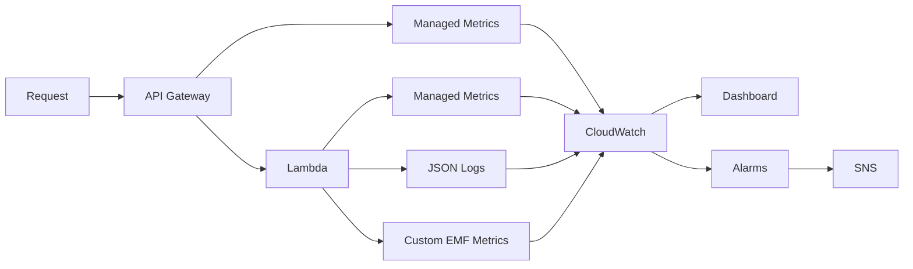
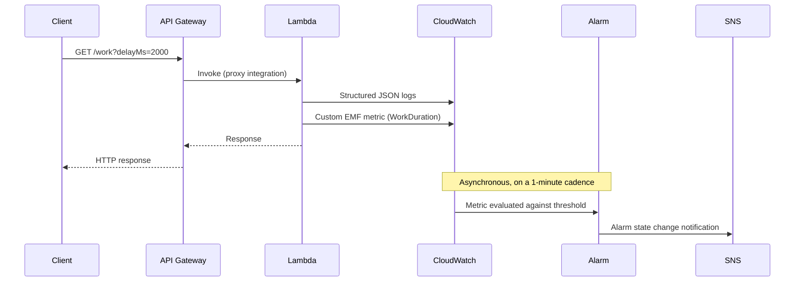

# Architecture

This document describes how the pieces of this sample fit together: the
system context, the telemetry pipeline, the request lifecycle, and the
design decisions behind the observability configuration. For a quicker
overview, see the [README](../README.md).

## System context



## Component responsibilities

| Component | Responsibility |
| --- | --- |
| API Gateway (REST API) | Public HTTPS entry point, request routing, publishes API-level metrics automatically |
| Lambda function | Executes the three demo routes, emits structured logs and custom metrics |
| CloudWatch Logs | Stores structured JSON log events with an explicit, finite retention period |
| CloudWatch Metrics | Stores time-series data from AWS-managed metrics and EMF-derived custom metrics |
| CloudWatch Dashboard | Presents a curated operational view across API, Lambda, and application signals |
| CloudWatch Alarms | Evaluate metric thresholds independently of the dashboard and change state |
| SNS Topic | Fans out alarm state changes to whatever is subscribed (e.g. an email address) |

## Telemetry flow



Two things worth noticing in this diagram:

1. Logs and custom metrics travel over the **same** path. Custom metrics in
   this project are Embedded Metric Format (EMF) log lines -- CloudWatch
   parses metric data out of the log stream. There is no separate
   `PutMetricData` API call.
2. The dashboard and the alarms are two independent consumers of
   CloudWatch. The dashboard does not drive the alarms, and the alarms do
   not depend on anyone having the dashboard open.

## Request lifecycle (sequence)



Metric aggregation and alarm evaluation are **not** part of the request/response
path. A client gets its HTTP response as soon as the Lambda function
returns; CloudWatch aggregates the metric data points and evaluates alarms
on its own schedule afterward. Don't expect an alarm to change state the
instant a bad request is sent -- see
[Alarm timing](#alarm-timing-is-not-instantaneous) below.

Written out as a numbered list:

1. Client calls API Gateway.
2. API Gateway invokes Lambda via a proxy integration.
3. Lambda captures request context (request ID, route, method).
4. Lambda emits structured JSON logs.
5. Lambda emits custom application metrics (EMF).
6. AWS automatically publishes Lambda metrics (Invocations, Errors, Duration, Throttles, ConcurrentExecutions).
7. AWS automatically publishes API Gateway metrics (Count, Latency, IntegrationLatency, 4XXError, 5XXError).
8. CloudWatch stores and aggregates all of the above.
9. The dashboard visualizes current operational health on demand.
10. Alarms evaluate metric thresholds independently, on their own period.
11. An alarm state change (into `ALARM` or back to `OK`) publishes to the SNS topic.

## Why API Gateway REST API (not HTTP API)

This sample uses an **API Gateway REST API** (`apigateway.RestApi`), not an
HTTP API (`apigatewayv2`). Both would work for a demo this small, but the
REST API was chosen because:

- Its CloudWatch metrics (`Count`, `Latency`, `IntegrationLatency`,
  `4XXError`, `5XXError`) are the metrics most commonly discussed in AWS
  observability material, and the ones the alarms and dashboard in this
  project use.
- It supports per-stage access logging to a CDK-managed log group, which
  this project uses to demonstrate API-side log retention alongside the
  Lambda's.

If you adapt this project to use an HTTP API, update the alarms and
dashboard: HTTP APIs report similarly named metrics but the dimension
(`ApiId` instead of `ApiName`) and some metric availability differ.

## Why Embedded Metric Format (EMF) for custom metrics

Custom metrics (`SuccessfulRequests`, `FailedRequests`, `WorkDuration`) are
published using **Embedded Metric Format**, not the `PutMetricData` API.

An EMF log line is a normal structured JSON log event with an added `_aws`
block describing which fields in that same JSON object are metric values,
and what CloudWatch namespace/dimensions to file them under. See
`src/shared/metrics.ts`. Example:

```json
{
  "_aws": {
    "Timestamp": 1734000000000,
    "CloudWatchMetrics": [
      {
        "Namespace": "ObservableServerlessApi",
        "Dimensions": [["Environment", "Operation"]],
        "Metrics": [{ "Name": "SuccessfulRequests", "Unit": "Count" }]
      }
    ]
  },
  "Environment": "dev",
  "Operation": "hello",
  "SuccessfulRequests": 1
}
```

CloudWatch Logs asynchronously extracts the metric data point from this log
event. This was chosen over calling `PutMetricData` directly because:

- **No extra IAM permission is required.** The Lambda function already has
  permission to write to its own CloudWatch Logs log group (via the
  `AWSLambdaBasicExecutionRole` managed policy CDK attaches by default). A
  `PutMetricData` approach would need an additional `cloudwatch:PutMetricData`
  statement on the execution role.
- **One write, two purposes.** The same JSON line is both a queryable log
  event (via Logs Insights) and a metric data point. That pairing is a
  useful thing to show in an educational project about how logs and
  metrics relate.
- **No extra network call.** `PutMetricData` is a synchronous API call from
  inside the handler; EMF only requires writing to stdout, which Lambda
  already redirects to CloudWatch Logs.

The tradeoff: EMF metrics are extracted asynchronously by the CloudWatch
Logs pipeline, so there can be a short additional delay (typically well
under a minute) between the log line being written and the metric data
point appearing, compared to a direct `PutMetricData` call.

## Alarm configuration and why

Every alarm in this project uses:

| Setting | Value | Why |
| --- | --- | --- |
| Period | 1 minute | Fast enough to demonstrate in a live session |
| Evaluation periods | 1 | One bad minute is enough to alarm in a demo |
| Datapoints to alarm | 1 | Matches evaluation periods -- no flapping tolerance built in |
| Missing data treatment | `notBreaching` | A quiet minute on a low-traffic demo API is not evidence of a problem |

This is deliberately **sensitive** -- a single error or a single slow
minute is enough to trip an alarm. That is appropriate for a lab
environment where you want to see the alarm fire on demand, and
inappropriate for most production services. See
[Production considerations](#production-considerations) below and the
[README's production section](../README.md#what-would-change-for-production)
for what a more realistic configuration looks like.

### Missing-data behavior

CloudWatch alarms have four options for what to do when a period has no
data points at all: `missing`, `ignore`, `breaching`, and `notBreaching`.
This project uses `notBreaching` for every alarm. A one-minute period with
zero requests is the normal state for a demo API between exercises --
that should not be treated as a failure. Treating missing data as
`breaching` would mean the alarms fire constantly whenever nobody is
actively sending traffic, which teaches the wrong lesson.

### Alarm timing is not instantaneous

CloudWatch aggregates metric data into periods (here, one minute), then
evaluates each alarm on its own schedule after a period closes. Between
sending a request that should trip an alarm and seeing the alarm's state
change in the console, expect **on the order of one to a few minutes**,
not seconds. EMF-derived custom metrics add a small additional processing
delay because they are extracted from logs rather than written directly.
Never assume "no alarm yet" after a few seconds means something is broken.

## Failure and latency simulation

`GET /work` accepts two query parameters purely for demonstration:

- `fail=true` -- the handler logs a structured `ERROR` entry and then
  throws. An unhandled exception in a Lambda proxy integration does two
  useful things simultaneously: it counts as a Lambda `Errors` data point,
  and API Gateway converts the failed invocation into an HTTP `502`, which
  counts toward API Gateway's `5XXError` metric. One simulated failure,
  two independently meaningful signals.
- `delayMs=<n>` -- the handler awaits a bounded `setTimeout` before
  responding. The value is clamped to a maximum of 5000ms server-side
  (regardless of what the caller requests) so a demo can't accidentally
  hold a Lambda invocation open for an excessive, billable amount of time.

Both parameters are for **demonstration and testing only**. A production
API should not ship a way for callers to force server-side errors or
delays.

## Dashboard design

The dashboard groups widgets into three rows -- API Health, Lambda Health,
Application Metrics -- plus an alarm status strip. This mirrors the
structure of this document and the README: managed API metrics, managed
Lambda metrics, and metrics the application itself defines. See the
README's [dashboard section](../README.md#cloudwatch-dashboard) for the
full widget list and the operational question each widget answers.

The goal of the layout is to teach **signal selection** -- a small number
of widgets that answer real operational questions -- rather than to
visualize every metric CloudWatch happens to offer.

## Observability principles this project demonstrates

- **Metrics, logs, alarms, dashboards, and runbooks are complementary, not
  redundant.** Each answers a different question; see the README's
  [Metrics vs logs vs traces](../README.md#metrics-vs-logs-vs-traces)
  section.
- **Structured logs are queryable; unstructured logs are only readable.**
  A JSON log line with consistent fields can be filtered and aggregated
  with CloudWatch Logs Insights; a free-text string like `"Request
  worked!"` cannot.
- **Correlation IDs turn a pile of log lines into a story about one
  request.** Every log line this Lambda writes includes the API Gateway
  request ID, so a single Logs Insights query can retrieve every log line
  produced while handling one specific request.
- **Low-cardinality dimensions keep metrics useful and affordable.**
  Custom metrics here are dimensioned only by `Environment` and
  `Operation` (three fixed values: `health`, `hello`, `work`) -- never by
  `requestId` or anything else with effectively unlimited possible values.
- **An alarm without a documented response is operational noise.** Every
  alarm in this stack references the runbook that explains what to do
  when it fires.
- **Telemetry is not free.** See `docs/cost-considerations.md` for what
  drives cost in this design and how to keep it in check.

## Production evolution

This sample intentionally stops short of several things a production
observability setup would include. They are not implemented here because
they would add complexity that competes with the core teaching goal
(logs, metrics, dashboards, alarms, runbooks) of this project:

- **AWS X-Ray** -- distributed tracing across services. Useful once a
  request touches more than one downstream system; this sample has a
  single Lambda function, so there is no request path to trace yet.
- **OpenTelemetry** -- vendor-neutral instrumentation, useful when
  multiple languages/runtimes/clouds need consistent traces and metrics.
  Adds an SDK and collector to a project that is currently dependency-free
  by design.
- **Percentage-based / error-rate alarms** -- `errors / requests` instead
  of an absolute error count. More meaningful at real traffic volumes; at
  demo traffic volumes an absolute count is easier to reason about and to
  trigger on purpose.
- **p90/p95/p99 latency alarms** -- CloudWatch supports extended
  statistics; this project uses `Average` for simplicity. Percentiles are
  usually a better production signal because averages hide tail latency.
- **SLOs/SLIs and error budgets** -- see the README's
  [production considerations](../README.md#what-would-change-for-production)
  section for a short introduction to these concepts.

See the README for the full "Implemented in this sample" vs "Recommended
for production" breakdown.
