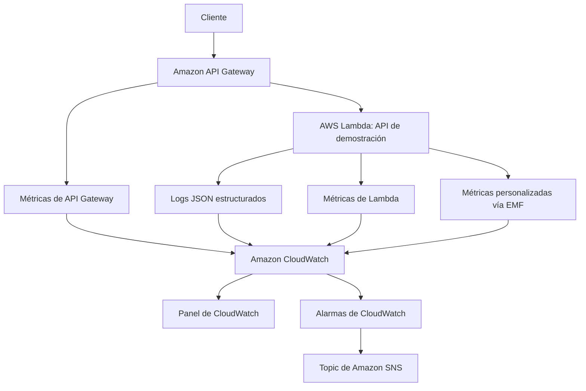
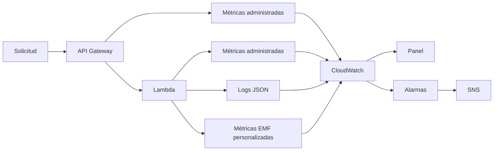
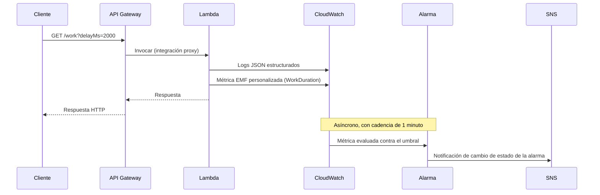

# Arquitectura

🌐 Idioma: [English](../architecture.md) | **Español**

Este documento describe cómo encajan entre sí las piezas de esta
muestra: el contexto del sistema, el pipeline de telemetría, el ciclo de
vida de la solicitud, y las decisiones de diseño detrás de la
configuración de observabilidad. Para una descripción más rápida,
consulta el [README](../../README.es.md).

## Contexto del sistema



## Responsabilidades de cada componente

| Componente | Responsabilidad |
| --- | --- |
| API Gateway (REST API) | Punto de entrada HTTPS público, enrutamiento de solicitudes, publica automáticamente métricas a nivel de API |
| Función Lambda | Ejecuta las tres rutas de demostración, emite logs estructurados y métricas personalizadas |
| CloudWatch Logs | Almacena eventos de log JSON estructurados con un período de retención explícito y finito |
| CloudWatch Metrics | Almacena datos de series temporales de las métricas administradas por AWS y las métricas personalizadas derivadas de EMF |
| Panel de CloudWatch (Dashboard) | Presenta una vista operativa curada de las señales de API, Lambda y aplicación |
| Alarmas de CloudWatch | Evalúan los umbrales de las métricas de forma independiente al panel, y cambian de estado |
| Topic de SNS | Distribuye (fan-out) los cambios de estado de las alarmas hacia quien esté suscrito (p. ej. una dirección de correo) |

## Flujo de telemetría



Dos cosas para notar en este diagrama:

1. Los logs y las métricas personalizadas viajan por la **misma** ruta.
   Las métricas personalizadas en este proyecto son líneas de log en
   Embedded Metric Format (EMF) -- CloudWatch extrae los datos de la
   métrica a partir del flujo de logs. No hay una llamada separada a la
   API `PutMetricData`.
2. El panel y las alarmas son dos consumidores independientes de
   CloudWatch. El panel no controla las alarmas, y las alarmas no
   dependen de que alguien tenga el panel abierto.

## Ciclo de vida de la solicitud (secuencia)



La agregación de métricas y la evaluación de alarmas **no** forman parte
de la ruta de solicitud/respuesta. Un cliente recibe su respuesta HTTP
tan pronto como la función Lambda retorna; CloudWatch agrega los puntos
de datos de la métrica y evalúa las alarmas según su propio cronograma
después de eso. No esperes que una alarma cambie de estado al instante
en que se envía una solicitud problemática -- ver
[El tiempo de la alarma no es instantáneo](#el-tiempo-de-la-alarma-no-es-instantáneo)
más abajo.

Expresado como una lista numerada:

1. El cliente llama a API Gateway.
2. API Gateway invoca a Lambda mediante una integración proxy.
3. Lambda captura el contexto de la solicitud (ID de solicitud, ruta,
   método).
4. Lambda emite logs JSON estructurados.
5. Lambda emite métricas personalizadas de la aplicación (EMF).
6. AWS publica automáticamente las métricas de Lambda (Invocations,
   Errors, Duration, Throttles, ConcurrentExecutions).
7. AWS publica automáticamente las métricas de API Gateway (Count,
   Latency, IntegrationLatency, 4XXError, 5XXError).
8. CloudWatch almacena y agrega todo lo anterior.
9. El panel visualiza el estado operativo actual bajo demanda.
10. Las alarmas evalúan los umbrales de las métricas de forma
    independiente, según su propio período.
11. Un cambio de estado de una alarma (a `ALARM` o de vuelta a `OK`)
    publica en el topic de SNS.

## Por qué API Gateway REST API (y no HTTP API)

Esta muestra usa una **REST API de API Gateway** (`apigateway.RestApi`),
no una HTTP API (`apigatewayv2`). Ambas funcionarían para una
demostración de este tamaño, pero se eligió REST API porque:

- Sus métricas de CloudWatch (`Count`, `Latency`, `IntegrationLatency`,
  `4XXError`, `5XXError`) son las métricas más comúnmente discutidas en
  el material de observabilidad de AWS, y las que usan las alarmas y el
  panel de este proyecto.
- Admite logs de acceso por stage hacia un grupo de logs administrado
  por CDK, lo cual este proyecto usa para demostrar la retención de logs
  del lado de la API junto con la de Lambda.

Si adaptas este proyecto para usar una HTTP API, actualiza las alarmas y
el panel: las HTTP API reportan métricas con nombres similares, pero la
dimensión (`ApiId` en lugar de `ApiName`) y la disponibilidad de algunas
métricas son diferentes.

## Por qué Embedded Metric Format (EMF) para las métricas personalizadas

Las métricas personalizadas (`SuccessfulRequests`, `FailedRequests`,
`WorkDuration`) se publican usando **Embedded Metric Format**, no la API
`PutMetricData`.

Una línea de log en EMF es un evento de log JSON estructurado normal,
con un bloque `_aws` adicional que describe qué campos de ese mismo
objeto JSON son valores de métricas, y bajo qué namespace/dimensiones de
CloudWatch archivarlos. Ver `src/shared/metrics.ts`. Ejemplo:

```json
{
  "_aws": {
    "Timestamp": 1734000000000,
    "CloudWatchMetrics": [
      {
        "Namespace": "ObservableServerlessApi",
        "Dimensions": [["Environment", "Operation"]],
        "Metrics": [{ "Name": "SuccessfulRequests", "Unit": "Count" }]
      }
    ]
  },
  "Environment": "dev",
  "Operation": "hello",
  "SuccessfulRequests": 1
}
```

CloudWatch Logs extrae el punto de datos de la métrica de forma
asíncrona a partir de este evento de log. Se eligió este enfoque en
lugar de llamar directamente a `PutMetricData` porque:

- **No se requiere ningún permiso IAM adicional.** La función Lambda ya
  tiene permiso para escribir en su propio grupo de logs de CloudWatch
  Logs (mediante la política administrada `AWSLambdaBasicExecutionRole`
  que CDK adjunta por defecto). Un enfoque con `PutMetricData` necesitaría
  una declaración adicional de `cloudwatch:PutMetricData` en el rol de
  ejecución.
- **Una escritura, dos propósitos.** La misma línea JSON es a la vez un
  evento de log consultable (vía Logs Insights) y un punto de datos de
  métrica. Esa combinación es útil de mostrar en un proyecto educativo
  sobre cómo se relacionan los logs y las métricas.
- **Sin llamada de red adicional.** `PutMetricData` es una llamada
  síncrona a la API desde dentro del handler; EMF solo requiere escribir
  a stdout, que Lambda ya redirige a CloudWatch Logs.

La contrapartida: las métricas de EMF se extraen de forma asíncrona
mediante el pipeline de CloudWatch Logs, así que puede haber un pequeño
retraso adicional (típicamente bastante menos de un minuto) entre el
momento en que se escribe la línea de log y el momento en que aparece el
punto de datos de la métrica, comparado con una llamada directa a
`PutMetricData`.

## Configuración de las alarmas y por qué

Cada alarma en este proyecto usa:

| Configuración | Valor | Por qué |
| --- | --- | --- |
| Período | 1 minuto | Suficientemente rápido para demostrar en una sesión en vivo |
| Períodos de evaluación | 1 | Un minuto malo es suficiente para alarmar en una demostración |
| Puntos de datos para alarmar | 1 | Coincide con los períodos de evaluación -- sin tolerancia a fluctuaciones (flapping) incorporada |
| Tratamiento de datos faltantes | `notBreaching` | Un minuto sin actividad en una API de demostración de bajo tráfico no es evidencia de un problema |

Esto es deliberadamente **sensible** -- un solo error o un solo minuto
lento es suficiente para disparar una alarma. Eso es apropiado para un
entorno de laboratorio donde quieres ver la alarma dispararse a demanda,
e inapropiado para la mayoría de los servicios en producción. Consulta
[Evolución hacia producción](#evolución-hacia-producción) más abajo y la
[sección de producción del README](../../README.es.md#qué-cambiaría-para-producción)
para ver cómo luce una configuración más realista.

### Comportamiento ante datos faltantes

Las alarmas de CloudWatch tienen cuatro opciones para qué hacer cuando un
período no tiene ningún punto de datos: `missing`, `ignore`, `breaching`,
y `notBreaching`. Este proyecto usa `notBreaching` para todas las
alarmas. Un período de un minuto con cero solicitudes es el estado
normal de una API de demostración entre ejercicios -- eso no debería
tratarse como un fallo. Tratar los datos faltantes como `breaching`
significaría que las alarmas se disparan constantemente cuando nadie
está enviando tráfico activamente, lo cual enseña la lección equivocada.

### El tiempo de la alarma no es instantáneo

CloudWatch agrega los datos de las métricas en períodos (aquí, un
minuto), y luego evalúa cada alarma según su propio cronograma después
de que cierra un período. Entre enviar una solicitud que debería
disparar una alarma y ver el cambio de estado de la alarma en la
consola, espera **del orden de uno a algunos minutos**, no segundos. Las
métricas personalizadas derivadas de EMF agregan un pequeño retraso de
procesamiento adicional porque se extraen de los logs en lugar de
escribirse directamente. Nunca asumas que "todavía no hay alarma"
después de unos segundos signifique que algo está roto.

## Simulación de fallos y latencia

`GET /work` acepta dos parámetros de consulta puramente para
demostración:

- `fail=true` -- el handler registra una entrada `ERROR` estructurada y
  luego lanza una excepción. Una excepción no controlada en una
  integración proxy de Lambda produce dos cosas útiles simultáneamente:
  cuenta como un punto de datos de `Errors` en Lambda, y API Gateway
  convierte la invocación fallida en un `502` HTTP, que cuenta hacia la
  métrica `5XXError` de API Gateway. Un solo fallo simulado, dos señales
  significativas de forma independiente.
- `delayMs=<n>` -- el handler espera (`await`) un `setTimeout` acotado
  antes de responder. El valor se limita a un máximo de 5000ms del lado
  del servidor (sin importar lo que solicite quien llama) para que una
  demostración no pueda mantener accidentalmente una invocación de
  Lambda abierta por una cantidad excesiva y facturable de tiempo.

Ambos parámetros son **solo para demostración y pruebas**. Una API de
producción no debería exponer una forma de que quienes llaman fuercen
errores o retrasos del lado del servidor.

## Diseño del panel

El panel agrupa los widgets en tres filas -- Salud de la API, Salud de
Lambda, Métricas de la aplicación -- más una franja de estado de
alarmas. Esto refleja la estructura de este documento y del README:
métricas administradas de la API, métricas administradas de Lambda, y
métricas que la propia aplicación define. Consulta la
[sección del panel en el README](../../README.es.md#panel-de-cloudwatch)
para la lista completa de widgets y la pregunta operativa que responde
cada uno.

El objetivo del diseño es enseñar **la selección de señales** -- un
número pequeño de widgets que responden preguntas operativas reales --
en lugar de visualizar cada métrica que CloudWatch ofrece.

## Principios de observabilidad que demuestra este proyecto

- **Las métricas, los logs, las alarmas, los paneles y los runbooks son
  complementarios, no redundantes.** Cada uno responde una pregunta
  distinta; consulta la sección
  [Métricas vs. logs vs. trazas](../../README.es.md#métricas-vs-logs-vs-trazas)
  del README.
- **Los logs estructurados son consultables; los logs sin estructura
  solo son legibles.** Una línea de log JSON con campos consistentes se
  puede filtrar y agregar con CloudWatch Logs Insights; una cadena de
  texto libre como `"Request worked!"` no.
- **Los identificadores de correlación convierten un montón de líneas de
  log en la historia de una solicitud.** Cada línea de log que escribe
  esta Lambda incluye el ID de solicitud de API Gateway, así que una
  sola consulta de Logs Insights puede recuperar cada línea de log
  producida al manejar una solicitud específica.
- **Las dimensiones de baja cardinalidad mantienen las métricas útiles y
  asequibles.** Las métricas personalizadas aquí tienen dimensiones
  únicamente por `Environment` y `Operation` (tres valores fijos:
  `health`, `hello`, `work`) -- nunca por `requestId` ni ningún otro
  campo con un número prácticamente ilimitado de valores posibles.
- **Una alarma sin una respuesta documentada es ruido operativo.** Cada
  alarma en este stack hace referencia al runbook que explica qué hacer
  cuando se dispara.
- **La telemetría no es gratis.** Consulta
  [`docs/es/cost-considerations.md`](cost-considerations.md) para ver
  qué impulsa el costo en este diseño y cómo mantenerlo bajo control.

## Evolución hacia producción

Esta muestra se detiene deliberadamente antes de varias cosas que
incluiría una configuración de observabilidad de producción. No están
implementadas aquí porque agregarían complejidad que compite con el
objetivo educativo central (logs, métricas, paneles, alarmas, runbooks)
de este proyecto:

- **AWS X-Ray** -- trazabilidad distribuida entre servicios. Útil una vez
  que una solicitud toca más de un sistema posterior; esta muestra tiene
  una única función Lambda, así que todavía no hay una ruta de solicitud
  que trazar.
- **OpenTelemetry** -- instrumentación independiente del proveedor, útil
  cuando múltiples lenguajes/runtimes/nubes necesitan trazas y métricas
  consistentes. Agrega un SDK y un collector a un proyecto que
  actualmente, por diseño, no tiene dependencias.
- **Alarmas por porcentaje / tasa de error** -- `errores / solicitudes`
  en lugar de un conteo absoluto de errores. Más significativo a
  volúmenes de tráfico reales; a los volúmenes de tráfico de una
  demostración, un conteo absoluto es más fácil de razonar y de disparar
  a propósito.
- **Alarmas de latencia p90/p95/p99** -- CloudWatch admite estadísticas
  extendidas; este proyecto usa `Average` por simplicidad. Los
  percentiles suelen ser una mejor señal en producción porque los
  promedios ocultan la latencia de cola (tail latency).
- **SLOs/SLIs y error budgets** -- consulta la sección de
  [consideraciones para producción del README](../../README.es.md#qué-cambiaría-para-producción)
  para una breve introducción a estos conceptos.

Consulta el README para el desglose completo de "Implementado en esta
muestra" vs. "Recomendado para producción".
